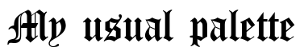
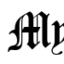
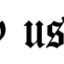
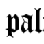
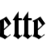
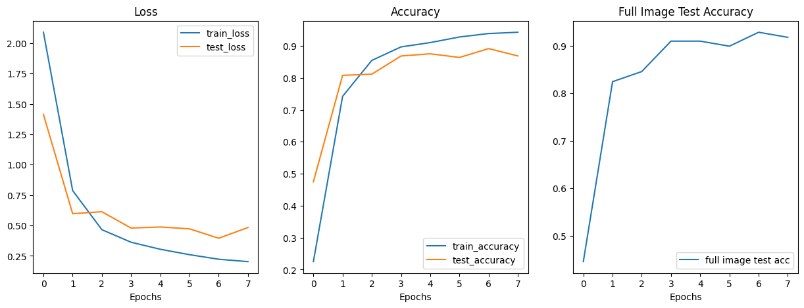

# Font Classifier

This repository contains the code for classifying fonts into their respective categories. The training dataset includes 10 different types of fonts, and the model achieves over 90% accuracy on the test set.

## Assumptions

It is assumed that the provided dataset contains sentences in a single line.

## Methodology

To expedite convergence, rather than resizing all images to a uniform dimension (e.g., 500 x 100), each image is divided into square subimages. The model is trained on these subimages, since the font remains consistent within each image. During testing, predictions are made by breaking each test image into subimages, summing the probabilities, and applying argmax to determine the final classification.  

Below is the full image of a training sample from Canterbury text

Below are the submiages for the same sample

## Results

Following are the loss and accuracy curves of the model

The loss and accuracy here refers to the loss and accuracy of the subimages. The "Full Image Test Accuracy" curve is the accuracy curve for the full image.